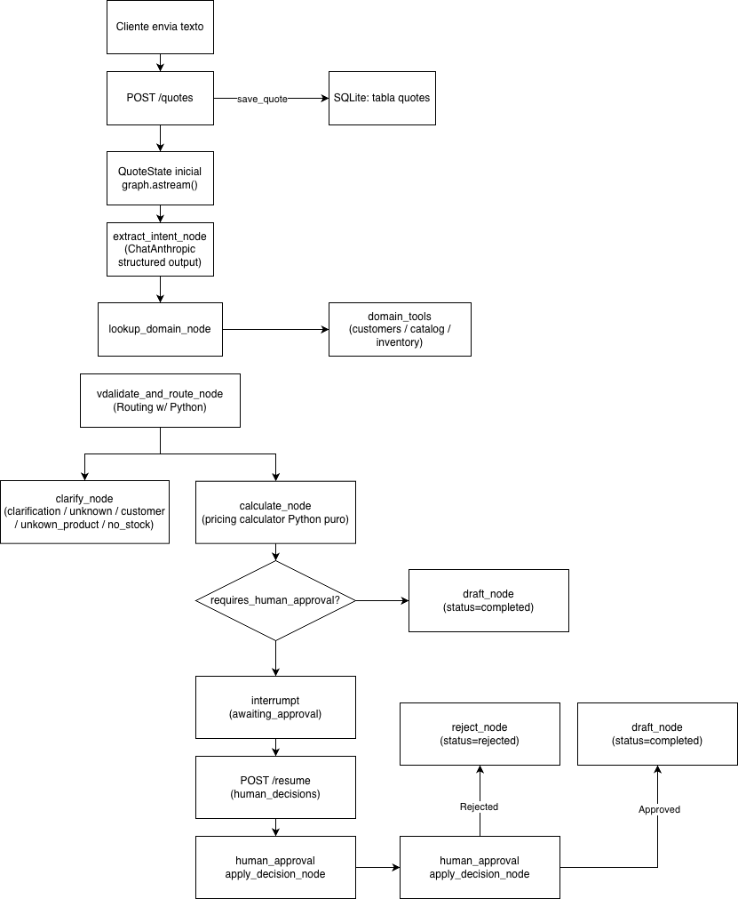

# IMPACT.md — Mapa de impacto del sistema

## Flujo principal de datos

El checkpointer (`AsyncSqliteSaver`) persiste el estado en cada paso, con
`thread_id == quote_id`. Por eso el interrupt sobrevive a un restart.

---

## Qué cambia si se modifica la política de descuentos / umbral

- **Descuentos por tier:** `backend/app/domain/pricing/calculator.py` → dict `TIER_MAX_DISCOUNT`.
- **Umbral de aprobación:** `backend/app/core/config.py` → `approval_threshold_usd`
  (o variable de entorno `APPROVAL_THRESHOLD_USD`).
- **No tocar:** ningún nodo del grafo, ningún prompt del LLM.
- **Verificar:** `backend/tests/unit/test_pricing.py` — actualizar valores esperados.

## Qué cambia si se agrega un producto al catálogo

- **Tocar:** `backend/app/domain/catalog/data.py` → dict `_CATALOG`.
- **También:** `backend/app/domain/inventory/data.py` → `_INVENTORY` (stock inicial).
- **No tocar:** nodos, prompts, tests existentes.
- **Verificar:** `test_find_product_by_exact_sku` / `test_get_stock_known_product` con el nuevo SKU.

## Qué cambia si se agrega un cliente

- **Tocar:** `backend/app/domain/customers/data.py` → dict `_CUSTOMERS`.
- **También:** `frontend/components/quote/RequestForm.tsx` → array `CUSTOMERS` del select.
- **No tocar:** grafo, API, pricing.
- **Verificar:** `test_known_customer_exists` con el nuevo ID.

## Qué cambia si se reemplaza el LLM

- **Tocar:** `backend/app/graph/nodes.py` → reemplazar `ChatAnthropic` en
  `extract_intent_node` y `draft_quote_node`.
- **También:** `backend/requirements.txt` (dependencia) y `backend/.env.example` (API key).
- **No tocar:** estado, routing, dominio, tests unitarios, frontend.
- **Verificar:** tests de integración con el nuevo mock (mantener `AsyncMock` si el cliente es async).

---

## Decisiones de diseño que este mapa hace evidentes

- **Dominio separado del grafo:** cualquier cambio de negocio (precios, política,
  catálogo, clientes) toca solo `domain/`, nunca `graph/`.
- **Routing sin LLM:** las decisiones de flujo son deterministas y testeables sin mocks.
- **`thread_id = quote_id`:** la durabilidad del checkpointer sale "gratis";
  el ID de la solicitud es el ID del thread.
- **Estado Pydantic serializable:** el checkpointer SQLite persiste y recupera el estado
  sin serialización custom.
