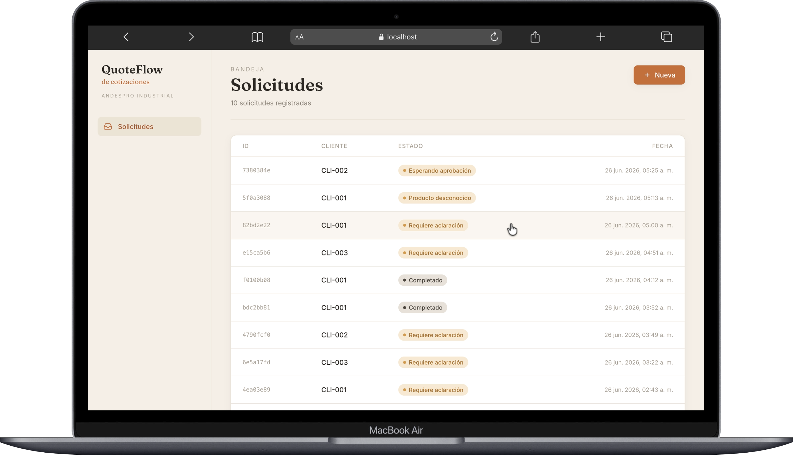

# QuoteFlow — AndesPro Industrial

Sistema agéntico full-stack que asiste al ejecutivo comercial de **AndesPro
Industrial** (distribuidor B2B de equipamiento industrial) en la preparación de
**borradores de cotización** a partir de solicitudes en texto libre, con
**human-in-the-loop durable** y trazabilidad completa.

> El MVP **nunca envía** al cliente: solo genera borradores para revisión humana.



---

## Qué hace

```
Texto libre del cliente
   → extrae intención (LLM, structured output)
   → consulta dominio (catálogo, inventario, política — determinista)
   → valida y rutea
   → calcula precio (funciones Python puras)
   → pausa para aprobación humana si aplica (interrupt durable)
   → genera borrador en español
```

Cinco resultados posibles, cada uno con un estado distinguible:
`clarification` · `unknown_product` / `no_stock` · `awaiting_approval` ·
`completed` · `rejected`.

---

## Stack

| Capa | Tecnología |
|---|---|
| Workflow agéntico | LangGraph (Python) + checkpointer SQLite (`AsyncSqliteSaver`) |
| Backend API | FastAPI |
| Estado tipado | Pydantic v2 |
| LLM (runtime) | Claude (`claude-opus-4-5`) vía `langchain-anthropic` |
| Frontend | Next.js 14 (App Router) + Tailwind CSS |

Decisión de stack documentada en [`docs/ADR-001-python-langgraph.md`](docs/ADR-001-python-langgraph.md).

---

## Estructura

```
futurelab/
├── backend/
│   ├── app/
│   │   ├── graph/        # state, nodes, routing, builder (LangGraph)
│   │   ├── domain/       # customers, catalog, inventory, pricing (determinista)
│   │   ├── tools/        # domain_tools (funciones puras que usa el grafo)
│   │   ├── api/routes/   # endpoints FastAPI
│   │   └── core/         # config, database
│   └── tests/            # unit + integration (LLM mockeado)
├── frontend/
│   ├── app/              # layout, requests (bandeja + detalle)
│   ├── components/       # Sidebar, quote/{StatusBadge, RequestForm}
│   └── lib/              # api client, status metadata
└── docs/                 # ADR + imágenes
```

---

## Cómo levantarlo

### Backend
```bash
cd backend
python3 -m venv .venv
source .venv/bin/activate
pip install -r requirements.txt
cp .env.example .env          # edita ANTHROPIC_API_KEY
uvicorn app.main:app --reload --port 8000
```

### Frontend
```bash
cd frontend
npm install
cp .env.example .env          # NEXT_PUBLIC_API_URL=http://localhost:8000
npm run dev                    # http://localhost:3000
```

### Tests (no requieren LLM real)
```bash
cd backend
source .venv/bin/activate
pytest tests/ -v               # 39 passed
```

---

## API REST

| Método | Ruta | Descripción |
|---|---|---|
| `GET` | `/health` | Healthcheck |
| `POST` | `/quotes` | Crear y ejecutar una solicitud |
| `GET` | `/quotes` | Listar solicitudes |
| `GET` | `/quotes/{id}` | Detalle + estado del grafo + `next_nodes` |
| `POST` | `/quotes/{id}/resume` | Reanudar tras aprobación/rechazo |

> El endpoint de creación es `POST /quotes` **sin** barra final.

Ejemplos ejecutables en [`EVIDENCE.md`](EVIDENCE.md).

---

## Reglas de negocio clave

- El LLM **no inventa** clientes, productos, precios, stock ni descuentos.
- Cotización **> USD 10,000** requiere aprobación humana.
- Descuento **sobre el máximo del tier** del cliente requiere aprobación.
- Cliente desconocido / producto desconocido / sin stock detienen el flujo.
- El cálculo de precio y la validación de políticas son **solo Python**, nunca LLM.

Datos seed: clientes `CLI-001` (Gold), `CLI-002` (Silver), `CLI-003` (Standard);
catálogo con SKUs como `BOM-M16-A4`, `MOT-5HP-IE3`, `VAL-GAT-2P`, `COM-TORN-50L`.

---

## Documentación

| Documento | Contenido |
|---|---|
| [`BUSINESS_CASE.md`](BUSINESS_CASE.md) | Usuario, problema, métricas, guardrails, piloto |
| [`PROJECT.md`](PROJECT.md) | Objetivo, alcance, reglas, DoD, restricciones |
| [`ROADMAP.md`](ROADMAP.md) | Fases con tareas atómicas, archivos, pruebas y DoD |
| [`STATUS.md`](STATUS.md) | Estado real, deuda técnica, fuera de scope |
| [`EVIDENCE.md`](EVIDENCE.md) | Comandos y resultados de ejecución por caso |
| [`docs/ADR-001-python-langgraph.md`](docs/ADR-001-python-langgraph.md) | Decisión de stack |
| [`IMPACT.md`](IMPACT.md) | Mapa de impacto: qué módulos tocar para cada cambio |
| [`AI_USE.md`](AI_USE.md) | Uso de IA: herramientas, outputs aceptados/rechazados, verificación |
| [`LOOP.md`](LOOP.md) | Próximo ciclo de mejora (multi-item) |

---

## Estado

MVP funcional. Suite de tests en verde (`39 passed`). Limitaciones conocidas y
deuda técnica aceptada en [`STATUS.md`](STATUS.md). Siguiente paso prioritario:
soporte multi-item ([`LOOP.md`](LOOP.md)).
